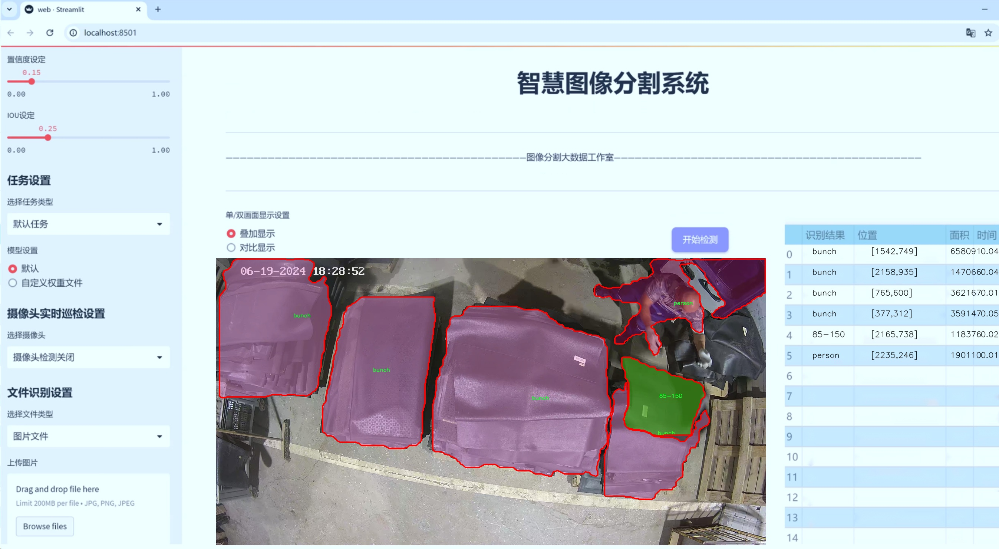
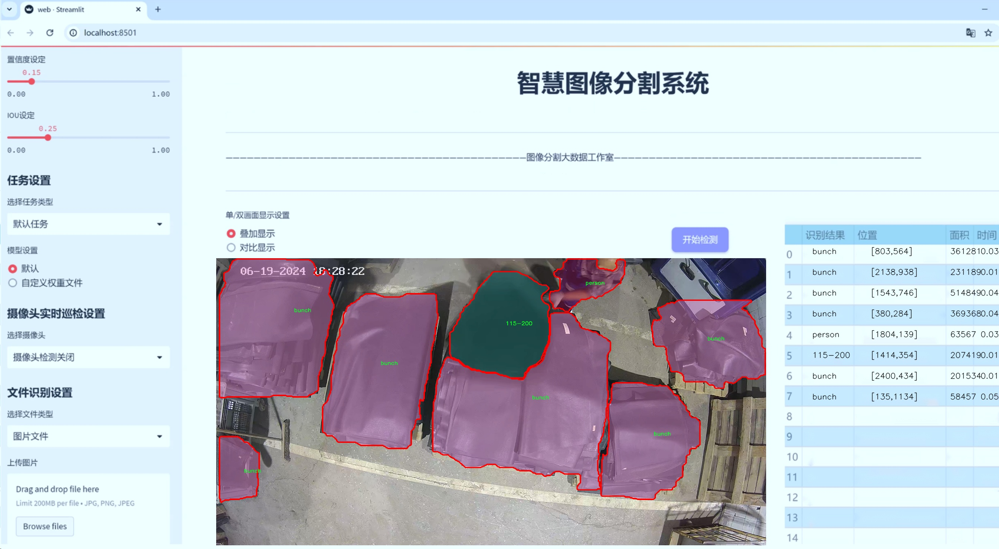
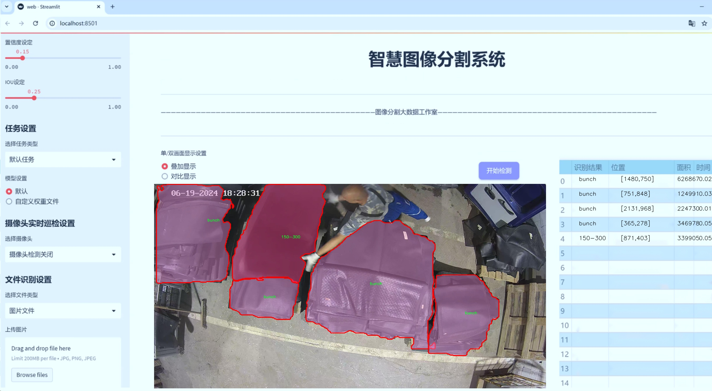
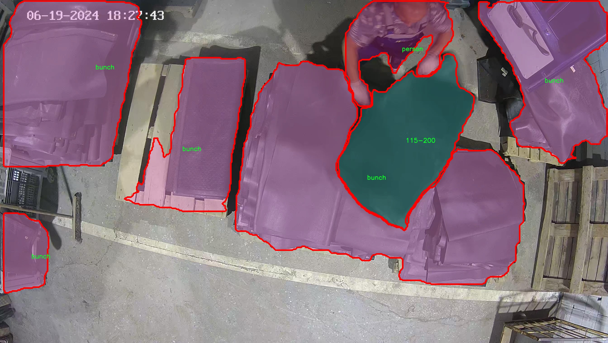
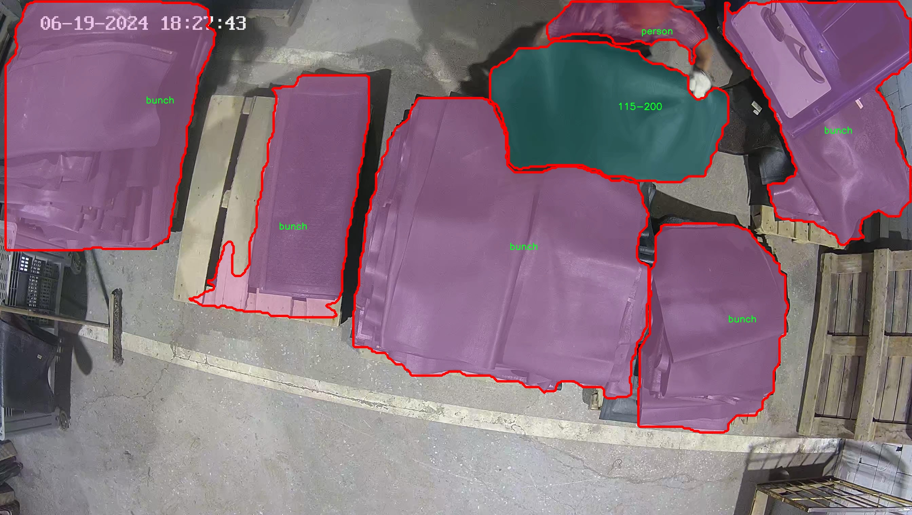
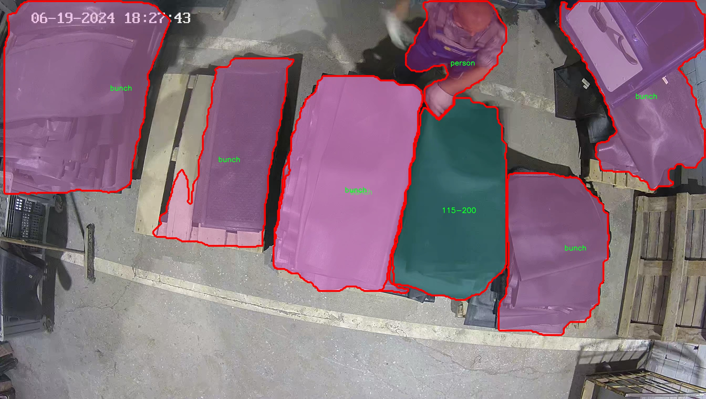
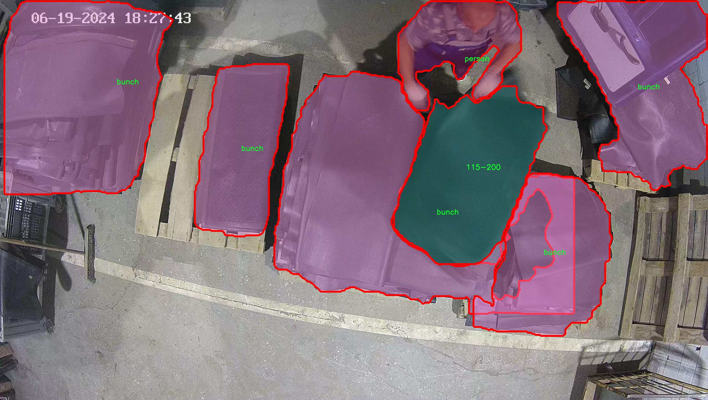
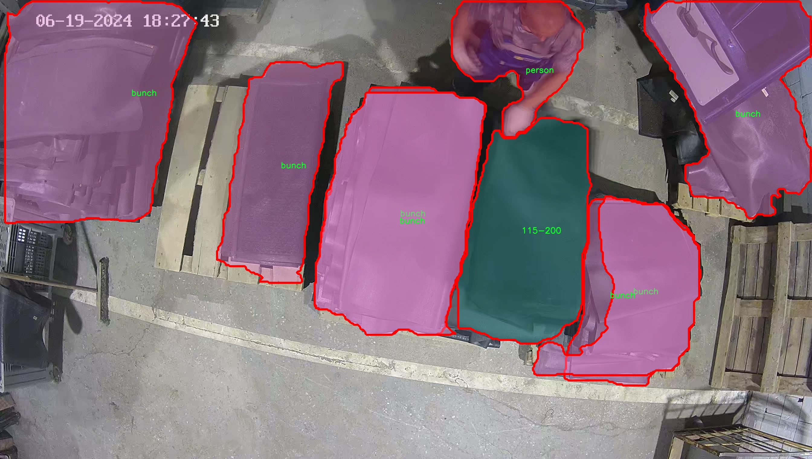

# 地毯图像分割系统： yolov8-seg-LAWDS

### 1.研究背景与意义

[参考博客](https://gitee.com/YOLOv8_YOLOv11_Segmentation_Studio/projects)

[博客来源](https://kdocs.cn/l/cszuIiCKVNis)

研究背景与意义

随着计算机视觉技术的迅速发展，图像分割作为其中一个重要的研究方向，已经在多个领域得到了广泛应用。尤其是在家居装饰行业，地毯的图像分割不仅能够提升产品展示的效果，还能为消费者提供更为直观的选择体验。近年来，基于深度学习的目标检测与分割技术，如YOLO（You Only Look Once）系列模型，因其高效性和准确性而受到广泛关注。YOLOv8作为该系列的最新版本，具备了更强的特征提取能力和实时处理能力，为地毯图像的分割提供了新的技术路径。

在本研究中，我们提出了一种基于改进YOLOv8的地毯图像分割系统，旨在提高地毯图像的分割精度和处理速度。我们的数据集“New_carpets_seg”包含1000张图像，涵盖了7个类别，包括不同尺寸的地毯（如115*200、115*400、150*300、60*90、85*150）以及“bunch”和“person”这两个类别。这些类别的设置不仅考虑了地毯的多样性，还兼顾了实际应用中的复杂场景，例如地毯上可能出现的人物和其他物品。这种多样化的数据集为模型的训练和测试提供了丰富的样本，有助于提升模型的泛化能力。

地毯图像的分割任务具有一定的挑战性，主要体现在地毯的纹理复杂性、颜色多样性以及与背景的相似性等方面。传统的图像分割方法往往难以处理这些复杂因素，而基于YOLOv8的深度学习方法则能够通过多层次的特征提取，自动学习到更为有效的特征表示，从而实现更高的分割精度。通过对YOLOv8模型的改进，我们可以针对地毯图像的特性进行优化，例如引入注意力机制、改进损失函数等，以进一步提升模型在地毯分割任务中的表现。

本研究的意义不仅在于技术上的创新，更在于其实际应用价值。随着电子商务的兴起，消费者在选择地毯时越来越依赖于在线平台提供的图像信息。一个高效、准确的地毯图像分割系统能够帮助商家更好地展示产品，提升用户体验，从而促进销售。此外，该系统还可以为家居设计师提供更为精准的参考，帮助他们在设计过程中更好地结合地毯与其他家居元素。

综上所述，基于改进YOLOv8的地毯图像分割系统的研究不仅具有重要的学术价值，也为实际应用提供了切实可行的解决方案。通过深入探讨和解决地毯图像分割中的关键问题，我们期望能够推动相关领域的技术进步，为未来的研究奠定基础。

### 2.图片演示







注意：本项目提供完整的训练源码数据集和训练教程,由于此博客编辑较早,暂不提供权重文件（best.pt）,需要按照6.训练教程进行训练后实现上图效果。

### 3.视频演示

[3.1 视频演示](https://www.bilibili.com/video/BV1XU6AYMEzD/)

### 4.数据集信息

##### 4.1 数据集类别数＆类别名

nc: 7
names: ['115-200', '115-400', '150-300', '60-90', '85-150', 'bunch', 'person']


##### 4.2 数据集信息简介

数据集信息展示

在现代计算机视觉领域，图像分割技术的应用日益广泛，尤其是在地毯图像的分析与处理方面。为此，我们构建了一个名为“New_carpets_seg”的数据集，旨在为改进YOLOv8-seg模型提供高质量的训练数据。该数据集专注于地毯图像的细致分割，涵盖了多种类型的地毯样式与人类活动场景，以提高模型在实际应用中的准确性和鲁棒性。

“New_carpets_seg”数据集包含七个不同的类别，具体包括：‘115-200’，‘115-400’，‘150-300’，‘60-90’，‘85-150’，‘bunch’和‘person’。这些类别不仅代表了不同尺寸和样式的地毯，还包括了与人类活动相关的元素，提供了一个多样化的环境，以便于模型在复杂场景中进行有效的分割。

首先，类别‘115-200’和‘115-400’代表了特定尺寸范围的地毯，这些地毯通常用于家庭和商业环境中，具有不同的纹理和颜色特征。‘150-300’类别则涵盖了更大尺寸的地毯，适用于更广阔的空间，如会议室和展览厅。每个类别的图像均经过精心标注，确保在训练过程中模型能够学习到这些地毯的独特特征和边界。

此外，‘60-90’和‘85-150’类别则展示了中小型地毯，这些地毯在家庭装饰中非常常见，具有多样的设计风格和用途。‘bunch’类别则指代了一组重叠或堆叠的地毯图像，这种情况在实际应用中经常出现，模型需要能够处理这种复杂的视觉信息，以实现准确的分割。

最后，‘person’类别的引入，使得数据集不仅限于地毯本身，还考虑了人类活动对地毯的影响。这一类别的存在旨在模拟现实生活中的场景，例如人们在地毯上行走、坐卧等情况，从而使得模型在处理动态场景时能够更为灵活和准确。

整个数据集的构建过程中，我们确保了图像的多样性和标注的准确性，以便于模型在训练时能够获得丰富的特征信息。每个类别的图像都经过精细的处理和筛选，确保了高质量的输入数据。此外，数据集还包括了不同光照、角度和背景的图像，以增强模型的泛化能力。

通过“New_carpets_seg”数据集的使用，我们期望能够显著提升YOLOv8-seg模型在地毯图像分割任务中的表现。数据集的多样性和复杂性将为模型提供充足的训练素材，使其能够在实际应用中实现更高的精度和效率。这一数据集不仅为研究人员提供了一个良好的实验平台，也为地毯行业的智能化发展奠定了基础。











### 5.项目依赖环境部署教程（零基础手把手教学）

[5.1 环境部署教程链接（零基础手把手教学）](https://www.bilibili.com/video/BV1jG4Ve4E9t/?vd_source=bc9aec86d164b67a7004b996143742dc)


[5.2 安装Python虚拟环境创建和依赖库安装视频教程链接（零基础手把手教学）](https://www.bilibili.com/video/BV1nA4VeYEze/?vd_source=bc9aec86d164b67a7004b996143742dc)

### 6.手把手YOLOV8-seg训练视频教程（零基础手把手教学）

[6.1 手把手YOLOV8-seg训练视频教程（零基础小白有手就能学会）](https://www.bilibili.com/video/BV1cA4VeYETe/?vd_source=bc9aec86d164b67a7004b996143742dc)


按照上面的训练视频教程链接加载项目提供的数据集，运行train.py即可开始训练



     Epoch   gpu_mem       box       obj       cls    labels  img_size
     1/200     0G   0.01576   0.01955  0.007536        22      1280: 100%|██████████| 849/849 [14:42<00:00,  1.04s/it]
               Class     Images     Labels          P          R     mAP@.5 mAP@.5:.95: 100%|██████████| 213/213 [01:14<00:00,  2.87it/s]
                 all       3395      17314      0.994      0.957      0.0957      0.0843

     Epoch   gpu_mem       box       obj       cls    labels  img_size
     2/200     0G   0.01578   0.01923  0.007006        22      1280: 100%|██████████| 849/849 [14:44<00:00,  1.04s/it]
               Class     Images     Labels          P          R     mAP@.5 mAP@.5:.95: 100%|██████████| 213/213 [01:12<00:00,  2.95it/s]
                 all       3395      17314      0.996      0.956      0.0957      0.0845

     Epoch   gpu_mem       box       obj       cls    labels  img_size
     3/200     0G   0.01561    0.0191  0.006895        27      1280: 100%|██████████| 849/849 [10:56<00:00,  1.29it/s]
               Class     Images     Labels          P          R     mAP@.5 mAP@.5:.95: 100%|███████   | 187/213 [00:52<00:00,  4.04it/s]
                 all       3395      17314      0.996      0.957      0.0957      0.0845


### 7.50+种全套YOLOV8-seg创新点加载调参实验视频教程（一键加载写好的改进模型的配置文件）

[7.1 50+种全套YOLOV8-seg创新点加载调参实验视频教程（一键加载写好的改进模型的配置文件）](https://www.bilibili.com/video/BV1Hw4VePEXv/?vd_source=bc9aec86d164b67a7004b996143742dc)

### YOLOV8-seg算法简介

原始YOLOv8-seg算法原理

YOLOv8-seg算法是YOLO系列的最新进展，旨在将目标检测与语义分割相结合，以实现更高效的图像理解。作为一种单阶段检测算法，YOLOv8-seg在精度和速度上均表现出色，成为计算机视觉领域的重要工具。该算法的核心在于其独特的网络结构和创新的特征处理方式，使其在处理复杂场景时具备更强的适应性和准确性。

YOLOv8-seg的网络结构主要由四个部分组成：输入层、Backbone骨干网络、Neck特征融合网络和Head检测模块。输入层负责对输入图像进行预处理，包括图像的比例调整、Mosaic增强和自适应锚框计算等。这些预处理步骤不仅提升了模型的鲁棒性，还为后续的特征提取打下了坚实的基础。

在Backbone部分，YOLOv8-seg采用了改进的DarkNet结构，使用C2f模块替代了传统的C3模块。C2f模块通过更多的分支和跨层连接，增强了梯度流动，使得模型在特征学习上更加高效。这种设计使得YOLOv8-seg能够更好地捕捉图像中的细节信息，尤其是在处理多尺度目标时，能够保持较高的特征表示能力。此外，SPPF（Spatial Pyramid Pooling Fusion）模块的引入，通过不同内核尺寸的池化操作，进一步提升了特征图的合并效果，使得网络在处理复杂背景时能够提取到更丰富的特征信息。

Neck部分采用了双塔结构，结合了特征金字塔网络（FPN）和路径聚合网络（PAN），这使得YOLOv8-seg在不同尺度目标的特征融合上表现得尤为出色。特征金字塔网络通过多层次的特征图处理，能够有效地整合来自不同层次的语义信息，而路径聚合网络则进一步优化了特征的传递和融合过程。这种结构的设计使得YOLOv8-seg在处理复杂场景时，能够更好地保持语义信息和定位信息的平衡，从而提升检测的准确性。

在Head模块中，YOLOv8-seg采用了解耦头的结构，将分类和回归分支分离开来。这种设计不仅加速了模型的收敛速度，还提高了目标检测的精度。YOLOv8-seg在损失计算过程中引入了Task-Aligned Assigner策略，根据分类与回归的分数加权结果选择正样本，从而实现更为精准的损失计算。此外，分类分支采用了二元交叉熵损失（BCELoss），而回归分支则结合了分布焦点损失（DFLoss）和完全交并比损失（CIOULoss），进一步提升了模型对边界框预测的准确性。

YOLOv8-seg的另一个重要特点是其无锚框（Anchor-Free）检测机制。这一机制使得模型在预测目标的中心点和宽高比例时，能够减少锚框的数量，从而提高检测速度和准确度。这种创新的设计理念使得YOLOv8-seg在实时检测任务中表现得尤为突出，能够在保证高精度的同时，满足实时性要求。

总的来说，YOLOv8-seg算法通过对网络结构的深度优化和特征处理方式的创新，成功地将目标检测与语义分割相结合，形成了一种高效、准确的图像理解工具。其在特征提取、特征融合和目标检测等多个方面的改进，使得YOLOv8-seg在复杂场景下的表现优于前代模型，展现出强大的应用潜力。在未来的研究中，YOLOv8-seg有望在更多实际应用场景中发挥重要作用，为计算机视觉领域的进一步发展提供新的动力。


### 9.系统功能展示（检测对象为举例，实际内容以本项目数据集为准）

图9.1.系统支持检测结果表格显示

  图9.2.系统支持置信度和IOU阈值手动调节

  图9.3.系统支持自定义加载权重文件best.pt(需要你通过步骤5中训练获得)

  图9.4.系统支持摄像头实时识别

  图9.5.系统支持图片识别

  图9.6.系统支持视频识别

  图9.7.系统支持识别结果文件自动保存

  图9.8.系统支持Excel导出检测结果数据


### 10.50+种全套YOLOV8-seg创新点原理讲解（非科班也可以轻松写刊发刊，V11版本正在科研待更新）

#### 10.1 由于篇幅限制，每个创新点的具体原理讲解就不一一展开，具体见下列网址中的创新点对应子项目的技术原理博客网址【Blog】：


[10.1 50+种全套YOLOV8-seg创新点原理讲解链接](https://gitee.com/qunmasj/good)

#### 10.2 部分改进模块原理讲解(完整的改进原理见上图和技术博客链接)【如果此小节的图加载失败可以通过CSDN或者Github搜索该博客的标题访问原始博客，原始博客图片显示正常】

### Gold-YOLO简介
YOLO再升级：华为诺亚提出Gold-YOLO，聚集-分发机制打造新SOTA
在过去的几年中，YOLO系列模型已经成为实时目标检测领域的领先方法。许多研究通过修改架构、增加数据和设计新的损失函数，将基线推向了更高的水平。然而以前的模型仍然存在信息融合问题，尽管特征金字塔网络（FPN）和路径聚合网络（PANet）已经在一定程度上缓解了这个问题。因此，本研究提出了一种先进的聚集和分发机制（GD机制），该机制通过卷积和自注意力操作实现。这种新设计的模型被称为Gold-YOLO，它提升了多尺度特征融合能力，在所有模型尺度上实现了延迟和准确性的理想平衡。此外，本文首次在YOLO系列中实现了MAE风格的预训练，使得YOLO系列模型能够从无监督预训练中受益。Gold-YOLO-N在COCO val2017数据集上实现了出色的39.9% AP，并在T4 GPU上实现了1030 FPS，超过了之前的SOTA模型YOLOv6-3.0-N，其FPS相似，但性能提升了2.4%。


#### Gold-YOLO


YOLO系列的中间层结构采用了传统的FPN结构，其中包含多个分支用于多尺度特征融合。然而，它只充分融合来自相邻级别的特征，对于其他层次的信息只能间接地进行“递归”获取。

传统的FPN结构在信息传输过程中存在丢失大量信息的问题。这是因为层之间的信息交互仅限于中间层选择的信息，未被选择的信息在传输过程中被丢弃。这种情况导致某个Level的信息只能充分辅助相邻层，而对其他全局层的帮助较弱。因此，整体上信息融合的有效性可能受到限制。
为了避免在传输过程中丢失信息，本文采用了一种新颖的“聚集和分发”机制（GD），放弃了原始的递归方法。该机制使用一个统一的模块来收集和融合所有Level的信息，并将其分发到不同的Level。通过这种方式，作者不仅避免了传统FPN结构固有的信息丢失问题，还增强了中间层的部分信息融合能力，而且并没有显著增加延迟。


# 8.低阶聚合和分发分支 Low-stage gather-and-distribute branch
从主干网络中选择输出的B2、B3、B4、B5特征进行融合，以获取保留小目标信息的高分辨率特征。


低阶特征对齐模块 (Low-stage feature alignment module)： 在低阶特征对齐模块（Low-FAM）中，采用平均池化（AvgPool）操作对输入特征进行下采样，以实现统一的大小。通过将特征调整为组中最小的特征大小（ R B 4 = 1 / 4 R ） （R_{B4} = 1/4R）（R 
B4 =1/4R），我们得到对齐后的特征F a l i g n F_{align}F align 。低阶特征对齐技术确保了信息的高效聚合，同时通过变换器模块来最小化后续处理的计算复杂性。其中选择 R B 4 R_{B4}R B4 作为特征对齐的目标大小主要基于保留更多的低层信息的同时不会带来较大的计算延迟。
低阶信息融合模块(Low-stage information fusion module)： 低阶信息融合模块（Low-IFM）设计包括多层重新参数化卷积块（RepBlock）和分裂操作。具体而言，RepBlock以F a l i g n ( c h a n n e l = s u m ( C B 2 ， C B 3 ， C B 4 ， C B 5 ) ) F_{align} (channel= sum(C_{B2}，C_{B3}，C_{B4}，C_{B5}))F align (channel=sum(C B2 ，C B3 ，C B4 ，C B5 )作为输入，并生成F f u s e ( c h a n n e l = C B 4 + C B 5 ) F_{fuse} (channel= C_{B4} + C_{B5})F fuse (channel=C B4 +C B5 )。其中中间通道是一个可调整的值（例如256），以适应不同的模型大小。由RepBlock生成的特征随后在通道维度上分裂为F i n j P 3 Finj_P3Finj P 3和F i n j P 4 Finj_P4Finj P 4，然后与不同级别的特征进行融合。


# 8.高阶聚合和分发分支 High-stage gather-and-distribute branch
高级全局特征对齐模块（High-GD）将由低级全局特征对齐模块（Low-GD）生成的特征{P3, P4, P5}进行融合。


高级特征对齐模块(High-stage feature alignment module)： High-FAM由avgpool组成，用于将输入特征的维度减小到统一的尺寸。具体而言，当输入特征的尺寸为{R P 3 R_{P3}R P3 , R P 4 R_{P4}R P4 , R P 5 R_{P 5}R P5 }时，avgpool将特征尺寸减小到该特征组中最小的尺寸（R P 5 R_{P5}R P5  = 1/8R）。由于transformer模块提取了高层次的信息，池化操作有助于信息聚合，同时降低了transformer模块后续步骤的计算需求。

Transformer融合模块由多个堆叠的transformer组成，transformer块的数量为L。每个transformer块包括一个多头注意力块、一个前馈网络（FFN）和残差连接。采用与LeViT相同的设置来配置多头注意力块，使用16个通道作为键K和查询Q的头维度，32个通道作为值V的头维度。为了加速推理过程，将层归一化操作替换为批归一化，并将所有的GELU激活函数替换为ReLU。为了增强变换器块的局部连接，在两个1x1卷积层之间添加了一个深度卷积层。同时，将FFN的扩展因子设置为2，以在速度和计算成本之间取得平衡。

信息注入模块(Information injection module)： 高级全局特征对齐模块（High-GD）中的信息注入模块与低级全局特征对齐模块（Low-GD）中的相同。在高级阶段，局部特征（Flocal）等于Pi，因此公式如下所示：


### 增强的跨层信息流动 Enhanced cross-layer information flow
为了进一步提升性能，从YOLOv8 中的PAFPN模块中得到启发，引入了Inject-LAF模块。该模块是注入模块的增强版，包括了一个轻量级相邻层融合（LAF）模块，该模块被添加到注入模块的输入位置。为了在速度和准确性之间取得平衡，设计了两个LAF模型：LAF低级模型和LAF高级模型，分别用于低级注入（合并相邻两层的特征）和高级注入（合并相邻一层的特征）。它们的结构如图5(b)所示。为了确保来自不同层级的特征图与目标大小对齐，在实现中的两个LAF模型仅使用了三个操作符：双线性插值（上采样过小的特征）、平均池化（下采样过大的特征）和1x1卷积（调整与目标通道不同的特征）。模型中的LAF模块与信息注入模块的结合有效地平衡了准确性和速度之间的关系。通过使用简化的操作，能够增加不同层级之间的信息流路径数量，从而提高性能而不显著增加延迟。


### 11.项目核心源码讲解（再也不用担心看不懂代码逻辑）

#### 11.1 log.py

以下是经过简化和注释的核心代码部分，保留了主要功能，并对每个函数和类进行了详细的中文注释：

```python
import os
import time
import cv2
import pandas as pd
from PIL import Image

def save_chinese_image(file_path, image_array):
    """
    保存带有中文路径的图片文件

    参数：
    file_path (str): 图片的保存路径，应包含中文字符
    image_array (numpy.ndarray): 要保存的 OpenCV 图像（即 numpy 数组）
    """
    try:
        # 将 OpenCV 图片转换为 Pillow Image 对象
        image = Image.fromarray(cv2.cvtColor(image_array, cv2.COLOR_BGR2RGB))
        # 使用 Pillow 保存图片文件
        image.save(file_path)
        print(f"成功保存图像到: {file_path}")
    except Exception as e:
        print(f"保存图像失败: {str(e)}")

class ResultLogger:
    def __init__(self):
        """
        初始化ResultLogger类，创建一个空的结果DataFrame。
        """
        self.results_df = pd.DataFrame(columns=["识别结果", "位置", "面积", "时间"])

    def concat_results(self, result, location, confidence, time):
        """
        将检测结果添加到结果DataFrame中。

        参数：
            result (str): 检测结果。
            location (str): 检测位置。
            confidence (str): 置信度。
            time (str): 检出目标所在时间。

        返回：
            pd.DataFrame: 更新后的DataFrame。
        """
        # 创建一个包含结果信息的字典
        result_data = {
            "识别结果": [result],
            "位置": [location],
            "面积": [confidence],
            "时间": [time]
        }
        # 将新结果添加到DataFrame
        new_row = pd.DataFrame(result_data)
        self.results_df = pd.concat([self.results_df, new_row], ignore_index=True)
        return self.results_df

class LogTable:
    def __init__(self, csv_file_path=None):
        """
        初始化LogTable类，尝试从CSV文件加载数据。

        参数：
            csv_file_path (str): 保存初始数据的CSV文件路径。
        """
        self.csv_file_path = csv_file_path
        self.data = pd.DataFrame(columns=['文件路径', '识别结果', '位置', '面积', '时间'])

        # 尝试加载CSV文件，如果不存在则创建一个空的DataFrame
        if csv_file_path and os.path.exists(csv_file_path):
            self.data = pd.read_csv(csv_file_path, encoding='utf-8')

    def add_log_entry(self, file_path, recognition_result, position, confidence, time_spent):
        """
        向日志中添加一条新记录。

        参数：
            file_path (str): 文件路径
            recognition_result (str): 识别结果
            position (str): 位置
            confidence (float): 置信度
            time_spent (float): 用时（通常是秒或毫秒）

        返回：
            None
        """
        # 创建新的数据行
        new_entry = pd.DataFrame([[file_path, recognition_result, position, confidence, time_spent]],
                                 columns=['文件路径', '识别结果', '位置', '面积', '时间'])
        # 将新行添加到DataFrame中
        self.data = pd.concat([new_entry, self.data]).reset_index(drop=True)

    def save_to_csv(self):
        """
        将更新后的DataFrame保存到CSV文件。
        """
        self.data.to_csv(self.csv_file_path, index=False, encoding='utf-8', mode='a', header=False)

    def update_table(self, log_table_placeholder):
        """
        更新表格，显示最新的500条记录。

        参数：
            log_table_placeholder: 表格占位符

        返回：
            None
        """
        # 判断DataFrame的长度是否超过500
        display_data = self.data.head(500) if len(self.data) > 500 else self.data
        log_table_placeholder.table(display_data)
```

### 代码核心部分说明：
1. **save_chinese_image**: 负责将图像保存到指定的中文路径，使用Pillow库处理图像格式转换。
2. **ResultLogger**: 用于记录检测结果的类，包含方法来添加和更新结果。
3. **LogTable**: 处理日志记录的类，能够从CSV文件加载数据、添加新记录、保存到CSV文件，并更新显示的表格。

### 注释说明：
每个函数和类都有详细的中文注释，解释其功能、参数和返回值，便于理解和维护。

这个 `log.py` 文件主要用于处理图像和日志记录，包含几个重要的功能模块。首先，文件导入了一些必要的库，包括 `os`、`time`、`cv2`（OpenCV）、`pandas`、`PIL`（Python Imaging Library）、`numpy` 和 `datetime`，这些库为图像处理、数据管理和时间处理提供了支持。

文件中定义了一个函数 `save_chinese_image`，该函数用于保存带有中文路径的图像。它接受两个参数：文件路径和图像数组。函数内部使用 OpenCV 将图像转换为 Pillow 的图像对象，然后保存到指定路径。如果保存成功，会打印成功信息；如果失败，则捕获异常并打印错误信息。

接下来，定义了一个 `ResultLogger` 类。这个类用于记录检测结果，初始化时创建一个空的 DataFrame，包含“识别结果”、“位置”、“面积”和“时间”四个列。`concat_results` 方法用于将新的检测结果添加到 DataFrame 中，并返回更新后的 DataFrame。

然后是 `LogTable` 类，它负责管理图像帧和日志记录。初始化时，它尝试从指定的 CSV 文件加载数据，如果文件不存在，则创建一个空的 DataFrame。该类有多个方法，包括 `add_frames` 用于添加图像和检测信息，`clear_frames` 用于清空已保存的图像和结果，`save_frames_file` 用于保存图像或视频文件。该方法根据保存的图像数量决定是保存为单张图片还是视频文件，并使用 OpenCV 的 `VideoWriter` 进行视频保存。

此外，`LogTable` 类还包含 `add_log_entry` 方法，用于向日志中添加新记录，`clear_data` 方法用于清空数据，`save_to_csv` 方法用于将更新后的 DataFrame 保存到 CSV 文件中，`update_table` 方法用于更新表格并显示最新的记录。

总体来说，这个文件提供了一个完整的框架，用于处理图像数据的保存、检测结果的记录以及日志的管理，适合用于需要图像处理和结果记录的应用场景。

#### 11.2 demo_test_image.py

以下是经过简化并添加详细中文注释的核心代码部分：

```python
import cv2
import numpy as np
from PIL import ImageFont, ImageDraw, Image
from hashlib import md5
from model import Web_Detector
from chinese_name_list import Label_list

def generate_color_based_on_name(name):
    # 使用MD5哈希函数生成稳定的颜色
    hash_object = md5(name.encode())
    hex_color = hash_object.hexdigest()[:6]  # 取前6位16进制数
    r, g, b = int(hex_color[0:2], 16), int(hex_color[2:4], 16), int(hex_color[4:6], 16)
    return (b, g, r)  # OpenCV使用BGR格式

def draw_with_chinese(image, text, position, font_size=20, color=(255, 0, 0)):
    # 在图像上绘制中文文本
    image_pil = Image.fromarray(cv2.cvtColor(image, cv2.COLOR_BGR2RGB))  # 转换为PIL格式
    draw = ImageDraw.Draw(image_pil)  # 创建绘图对象
    font = ImageFont.truetype("simsun.ttc", font_size, encoding="unic")  # 加载中文字体
    draw.text(position, text, font=font, fill=color)  # 绘制文本
    return cv2.cvtColor(np.array(image_pil), cv2.COLOR_RGB2BGR)  # 转换回OpenCV格式

def draw_detections(image, info):
    # 根据检测信息在图像上绘制检测框和文本
    name, bbox = info['class_name'], info['bbox']  # 获取类别名称和边界框
    x1, y1, x2, y2 = bbox  # 解包边界框坐标
    cv2.rectangle(image, (x1, y1), (x2, y2), color=(0, 0, 255), thickness=3)  # 绘制边界框
    image = draw_with_chinese(image, name, (x1, y1 - 10), font_size=20)  # 绘制类别名称
    return image

def process_frame(model, image):
    # 处理单帧图像，进行目标检测
    pre_img = model.preprocess(image)  # 预处理图像
    pred = model.predict(pre_img)  # 进行预测
    det = pred[0]  # 获取检测结果

    if det is not None and len(det):
        det_info = model.postprocess(pred)  # 后处理获取检测信息
        for info in det_info:
            image = draw_detections(image, info)  # 绘制检测结果
    return image

if __name__ == "__main__":
    model = Web_Detector()  # 初始化检测模型
    model.load_model("./weights/yolov8s-seg.pt")  # 加载模型权重

    # 图片处理
    image_path = './icon/OIP.jpg'
    image = cv2.imread(image_path)  # 读取图像
    if image is not None:
        processed_image = process_frame(model, image)  # 处理图像
        cv2.imshow('Processed Image', processed_image)  # 显示处理后的图像
        cv2.waitKey(0)  # 等待按键
        cv2.destroyAllWindows()  # 关闭窗口
    else:
        print('Image not found.')  # 图像未找到的提示
```

### 代码核心部分说明：
1. **生成颜色**：`generate_color_based_on_name`函数通过MD5哈希生成一个稳定的颜色，确保相同的名称总是对应相同的颜色。
2. **绘制中文文本**：`draw_with_chinese`函数使用PIL库在图像上绘制中文文本，支持中文字体。
3. **绘制检测结果**：`draw_detections`函数根据检测信息在图像上绘制边界框和类别名称。
4. **处理图像帧**：`process_frame`函数负责预处理图像、进行目标检测并绘制检测结果。
5. **主程序**：在`__main__`中初始化模型，加载权重，读取图像并进行处理，最后显示处理后的图像。

这个程序文件`demo_test_image.py`主要用于图像处理，特别是使用深度学习模型进行目标检测和分割。程序的核心功能是读取一张图片，利用训练好的模型进行目标检测，并在图像上绘制检测到的目标的边界框、类别名称及相关的度量信息。

首先，程序导入了一些必要的库，包括`random`、`cv2`（OpenCV库）、`numpy`、`PIL`（用于处理图像的库）以及`hashlib`（用于生成哈希值）。它还导入了一个名为`Web_Detector`的模型类和一个包含标签名称的列表`Label_list`。

程序中定义了多个函数。`generate_color_based_on_name`函数根据输入的名称生成一个稳定的颜色，这个颜色是通过对名称进行MD5哈希处理得到的。接着，`calculate_polygon_area`函数用于计算多边形的面积，使用OpenCV的`contourArea`函数实现。

`draw_with_chinese`函数用于在图像上绘制中文文本。它将OpenCV图像转换为PIL图像，以便使用指定的字体绘制文本，并返回绘制后的图像。`adjust_parameter`函数根据图像的大小调整参数，以便在不同尺寸的图像上保持一致的绘制效果。

`draw_detections`函数是程序的核心部分之一，它负责在图像上绘制检测到的目标。它根据目标的边界框（bbox）绘制矩形框，并在框上方绘制类别名称。如果目标有分割掩码（mask），则会填充该区域并绘制轮廓，同时计算并显示目标的面积、周长、圆度和颜色信息。

`process_frame`函数用于处理每一帧图像。它首先对图像进行预处理，然后使用模型进行预测，最后将检测到的信息传递给`draw_detections`函数进行绘制。

在程序的主入口部分，首先加载标签列表和深度学习模型，然后读取指定路径的图像。如果图像成功读取，程序将调用`process_frame`函数处理图像，并使用OpenCV显示处理后的图像。如果图像未找到，则输出相应的提示信息。

总体来说，这个程序实现了一个完整的目标检测和分割的流程，从读取图像到显示结果，结合了深度学习模型和图像处理技术。

#### 11.3 ultralytics\solutions\object_counter.py

以下是经过简化和注释的核心代码部分，主要保留了对象计数的逻辑和相关功能：

```python
# 导入必要的库
from collections import defaultdict
import cv2
from shapely.geometry import Polygon, Point
from ultralytics.utils.plotting import Annotator, colors

class ObjectCounter:
    """管理实时视频流中对象计数的类。"""

    def __init__(self):
        """初始化计数器，设置默认值。"""
        self.is_drawing = False  # 是否正在绘制区域
        self.selected_point = None  # 选中的点
        self.reg_pts = None  # 区域的顶点
        self.counting_region = None  # 计数区域
        self.names = None  # 类别名称
        self.in_counts = 0  # 进入计数
        self.out_counts = 0  # 离开计数
        self.counting_list = []  # 当前计数的对象列表
        self.track_history = defaultdict(list)  # 跟踪历史
        self.track_thickness = 2  # 跟踪线厚度
        self.draw_tracks = False  # 是否绘制轨迹

    def set_args(self, classes_names, reg_pts, region_color=None, line_thickness=2, track_thickness=2, view_img=False, draw_tracks=False):
        """
        配置计数器的参数，包括类别名称、区域顶点和绘制选项。

        Args:
            classes_names (dict): 类别名称字典
            reg_pts (list): 定义计数区域的顶点列表
            region_color (tuple): 区域颜色
            line_thickness (int): 边框线厚度
            track_thickness (int): 跟踪线厚度
            view_img (bool): 是否显示视频流
            draw_tracks (bool): 是否绘制轨迹
        """
        self.reg_pts = reg_pts  # 设置区域顶点
        self.counting_region = Polygon(self.reg_pts)  # 创建计数区域多边形
        self.names = classes_names  # 设置类别名称
        self.view_img = view_img  # 设置是否显示图像
        self.draw_tracks = draw_tracks  # 设置是否绘制轨迹
        self.track_thickness = track_thickness  # 设置跟踪线厚度

    def extract_and_process_tracks(self, tracks):
        """
        提取和处理跟踪信息，进行对象计数。

        Args:
            tracks (list): 从对象跟踪过程中获得的跟踪列表
        """
        boxes = tracks[0].boxes.xyxy.cpu()  # 获取边界框坐标
        clss = tracks[0].boxes.cls.cpu().tolist()  # 获取类别
        track_ids = tracks[0].boxes.id.int().cpu().tolist()  # 获取跟踪ID

        self.annotator = Annotator(self.im0, 2, self.names)  # 初始化Annotator
        self.annotator.draw_region(reg_pts=self.reg_pts, color=(0, 255, 0))  # 绘制计数区域

        for box, track_id, cls in zip(boxes, track_ids, clss):
            self.annotator.box_label(box, label=self.names[cls], color=colors(int(cls), True))  # 绘制边界框

            # 更新跟踪历史
            track_line = self.track_history[track_id]
            track_line.append((float((box[0] + box[2]) / 2), float((box[1] + box[3]) / 2)))
            if len(track_line) > 30:
                track_line.pop(0)  # 保持跟踪历史长度

            # 计数对象
            if self.counting_region.contains(Point(track_line[-1])):  # 检查是否在计数区域内
                if track_id not in self.counting_list:  # 如果是新对象
                    self.counting_list.append(track_id)  # 添加到计数列表
                    if box[0] < self.counting_region.centroid.x:  # 判断对象是进入还是离开
                        self.out_counts += 1
                    else:
                        self.in_counts += 1

        # 显示计数结果
        if self.view_img:
            incount_label = 'InCount : ' + f'{self.in_counts}'
            outcount_label = 'OutCount : ' + f'{self.out_counts}'
            self.annotator.count_labels(in_count=incount_label, out_count=outcount_label)  # 显示计数标签
            cv2.imshow('Ultralytics YOLOv8 Object Counter', self.im0)  # 显示图像
            if cv2.waitKey(1) & 0xFF == ord('q'):  # 按'q'退出
                return

    def start_counting(self, im0, tracks):
        """
        启动对象计数过程。

        Args:
            im0 (ndarray): 当前视频帧
            tracks (list): 从对象跟踪过程中获得的跟踪列表
        """
        self.im0 = im0  # 存储当前图像
        if tracks[0].boxes.id is None:  # 如果没有跟踪ID，返回
            return
        self.extract_and_process_tracks(tracks)  # 提取和处理跟踪信息

if __name__ == '__main__':
    ObjectCounter()  # 创建ObjectCounter实例
```

### 代码说明：
1. **类的初始化**：`__init__`方法设置了计数器的初始状态，包括区域绘制、计数和跟踪信息。
2. **参数设置**：`set_args`方法用于配置计数器的参数，如类别名称、区域顶点和绘制选项。
3. **跟踪提取与处理**：`extract_and_process_tracks`方法负责提取跟踪信息，更新计数，并绘制边界框和轨迹。
4. **计数逻辑**：通过判断对象是否在计数区域内来更新进入和离开的计数。
5. **启动计数**：`start_counting`方法是主计数过程，接收当前帧和跟踪信息进行处理。

这个程序文件定义了一个名为 `ObjectCounter` 的类，主要用于在实时视频流中基于物体的轨迹进行计数。程序的结构和功能如下：

首先，程序导入了一些必要的库，包括 `defaultdict` 用于存储和管理数据，`cv2` 用于图像处理，以及 `shapely` 库用于处理几何形状。`check_requirements` 函数用于检查所需的库是否已安装。

`ObjectCounter` 类的构造函数 `__init__` 初始化了一些属性，包括鼠标事件的状态、计数区域的信息、图像和注释的信息、物体计数的信息以及轨迹信息等。计数区域的颜色、图像显示标志、物体计数的输入和输出数量、以及跟踪历史等也在这里被初始化。

`set_args` 方法用于配置计数器的参数，包括类名、计数区域的点、区域颜色、线条厚度等。该方法会将这些参数存储到类的属性中，并使用 `Polygon` 类创建一个表示计数区域的多边形。

`mouse_event_for_region` 方法处理鼠标事件，使用户能够通过鼠标在视频流中绘制和移动计数区域。根据不同的鼠标事件（如按下、移动和释放），该方法会更新计数区域的顶点坐标。

`extract_and_process_tracks` 方法用于提取和处理物体的轨迹。它从输入的轨迹数据中获取边界框、类别和跟踪ID，并使用 `Annotator` 类绘制这些信息。该方法还会检查物体是否进入或离开计数区域，并更新相应的计数。若启用了轨迹绘制功能，该方法还会绘制物体的运动轨迹。

`start_counting` 方法是计数过程的主函数。它接收当前帧图像和跟踪数据，调用 `extract_and_process_tracks` 方法进行处理。如果没有有效的跟踪ID，函数将直接返回。

最后，程序的入口部分创建了 `ObjectCounter` 类的实例，但没有进一步的执行逻辑。这意味着该类的实例化需要在其他地方被调用以启动计数过程。

总体来说，这个程序实现了一个实时物体计数器，能够通过用户交互设置计数区域，并在视频流中实时更新计数结果。

#### 11.4 ultralytics\trackers\byte_tracker.py

以下是经过简化和注释的核心代码部分，主要集中在 `STrack` 和 `BYTETracker` 类的关键功能上：

```python
import numpy as np
from .basetrack import BaseTrack, TrackState
from .utils import matching
from .utils.kalman_filter import KalmanFilterXYAH

class STrack(BaseTrack):
    """
    单目标跟踪表示，使用卡尔曼滤波进行状态估计。
    """

    shared_kalman = KalmanFilterXYAH()  # 共享的卡尔曼滤波器实例

    def __init__(self, tlwh, score, cls):
        """初始化新的 STrack 实例。"""
        # 将输入的边界框格式转换为 tlwh 格式
        self._tlwh = np.asarray(self.tlbr_to_tlwh(tlwh[:-1]), dtype=np.float32)
        self.kalman_filter = None  # 当前对象的卡尔曼滤波器
        self.mean, self.covariance = None, None  # 状态均值和协方差
        self.is_activated = False  # 跟踪是否被激活

        self.score = score  # 置信度分数
        self.tracklet_len = 0  # 跟踪长度
        self.cls = cls  # 对象类别
        self.idx = tlwh[-1]  # 对象索引

    def predict(self):
        """使用卡尔曼滤波器预测对象的下一个状态。"""
        mean_state = self.mean.copy()  # 复制当前均值状态
        if self.state != TrackState.Tracked:
            mean_state[7] = 0  # 如果状态不是跟踪状态，设置速度为0
        self.mean, self.covariance = self.kalman_filter.predict(mean_state, self.covariance)  # 预测下一个状态

    def activate(self, kalman_filter, frame_id):
        """激活新的跟踪实例。"""
        self.kalman_filter = kalman_filter  # 关联卡尔曼滤波器
        self.track_id = self.next_id()  # 获取新的跟踪ID
        self.mean, self.covariance = self.kalman_filter.initiate(self.convert_coords(self._tlwh))  # 初始化状态

        self.tracklet_len = 0  # 重置跟踪长度
        self.state = TrackState.Tracked  # 设置状态为跟踪
        if frame_id == 1:
            self.is_activated = True  # 如果是第一帧，激活跟踪
        self.frame_id = frame_id  # 当前帧ID
        self.start_frame = frame_id  # 跟踪开始帧

class BYTETracker:
    """
    BYTETracker: 基于 YOLOv8 的对象检测和跟踪算法。
    """

    def __init__(self, args, frame_rate=30):
        """初始化 YOLOv8 对象以跟踪对象。"""
        self.tracked_stracks = []  # 成功激活的跟踪列表
        self.lost_stracks = []  # 丢失的跟踪列表
        self.removed_stracks = []  # 移除的跟踪列表

        self.frame_id = 0  # 当前帧ID
        self.args = args  # 命令行参数
        self.max_time_lost = int(frame_rate / 30.0 * args.track_buffer)  # 最大丢失时间
        self.kalman_filter = self.get_kalmanfilter()  # 获取卡尔曼滤波器
        self.reset_id()  # 重置ID

    def update(self, results, img=None):
        """使用新检测更新对象跟踪器并返回跟踪对象的边界框。"""
        self.frame_id += 1  # 增加帧ID
        activated_stracks = []  # 激活的跟踪
        refind_stracks = []  # 重新找到的跟踪
        lost_stracks = []  # 丢失的跟踪
        removed_stracks = []  # 移除的跟踪

        scores = results.conf  # 检测分数
        bboxes = results.xyxy  # 检测边界框
        bboxes = np.concatenate([bboxes, np.arange(len(bboxes)).reshape(-1, 1)], axis=-1)  # 添加索引
        cls = results.cls  # 类别

        # 根据阈值筛选检测
        remain_inds = scores > self.args.track_high_thresh
        dets = bboxes[remain_inds]  # 高分检测
        scores_keep = scores[remain_inds]  # 高分检测的分数
        cls_keep = cls[remain_inds]  # 高分检测的类别

        # 初始化跟踪
        detections = self.init_track(dets, scores_keep, cls_keep, img)
        # 处理当前跟踪
        strack_pool = self.joint_stracks(self.tracked_stracks, self.lost_stracks)  # 合并跟踪列表
        self.multi_predict(strack_pool)  # 预测当前跟踪位置

        # 计算距离并进行匹配
        dists = self.get_dists(strack_pool, detections)
        matches, u_track, u_detection = matching.linear_assignment(dists, thresh=self.args.match_thresh)

        # 更新匹配的跟踪
        for itracked, idet in matches:
            track = strack_pool[itracked]
            det = detections[idet]
            track.update(det, self.frame_id)  # 更新跟踪状态
            activated_stracks.append(track)  # 添加到激活列表

        # 初始化新的跟踪
        for inew in u_detection:
            track = detections[inew]
            if track.score < self.args.new_track_thresh:
                continue
            track.activate(self.kalman_filter, self.frame_id)  # 激活新的跟踪
            activated_stracks.append(track)

        # 更新状态
        self.tracked_stracks = self.joint_stracks(self.tracked_stracks, activated_stracks)  # 更新跟踪列表
        return np.asarray([x.tlbr.tolist() + [x.track_id, x.score, x.cls] for x in self.tracked_stracks if x.is_activated], dtype=np.float32)

    def get_kalmanfilter(self):
        """返回用于跟踪边界框的卡尔曼滤波器对象。"""
        return KalmanFilterXYAH()

    def init_track(self, dets, scores, cls, img=None):
        """使用检测和分数初始化对象跟踪。"""
        return [STrack(xyxy, s, c) for (xyxy, s, c) in zip(dets, scores, cls)] if len(dets) else []  # 返回跟踪实例

    def get_dists(self, tracks, detections):
        """计算跟踪和检测之间的距离。"""
        dists = matching.iou_distance(tracks, detections)  # 计算IOU距离
        return dists  # 返回距离
```

### 代码说明
1. **STrack 类**: 负责单个对象的跟踪，使用卡尔曼滤波器进行状态预测和更新。它包含了对象的位置信息、状态、置信度等属性。
2. **BYTETracker 类**: 负责管理多个对象的跟踪，包括初始化、更新和状态管理。它使用卡尔曼滤波器预测对象的位置，并通过距离计算和匹配算法来关联检测到的对象和跟踪对象。

这个程序文件实现了一个基于YOLOv8的对象跟踪算法，主要包含两个类：`STrack`和`BYTETracker`。`STrack`类用于表示单个对象的跟踪状态，利用卡尔曼滤波进行状态估计和更新，而`BYTETracker`类则负责管理多个对象的跟踪。

在`STrack`类中，主要定义了对象的属性和方法。属性包括共享的卡尔曼滤波器、边界框的坐标、卡尔曼滤波器实例、状态均值和协方差、激活状态、置信度分数、跟踪长度、类别标签、对象索引、当前帧ID和起始帧ID等。该类的方法包括预测对象的下一个状态、激活新的跟踪、更新状态、转换坐标格式等。

`BYTETracker`类则是整个跟踪算法的核心，负责初始化、更新和管理视频序列中检测到的对象的跟踪。它维护了被跟踪、丢失和移除的跟踪状态，并利用卡尔曼滤波预测新的对象位置。该类的方法包括更新跟踪器、获取卡尔曼滤波器、初始化跟踪、计算跟踪与检测之间的距离、联合和过滤跟踪列表等。

在更新方法中，首先会处理新的检测结果，进行高置信度和低置信度的检测分离，然后通过卡尔曼滤波器预测当前跟踪的位置，并与新检测进行匹配。匹配成功的跟踪会更新其状态，未匹配的跟踪则会被标记为丢失或移除。最后，更新后的跟踪状态会被返回，以便进行后续处理。

整个代码结构清晰，功能分明，利用卡尔曼滤波的预测能力有效地实现了对多个对象的实时跟踪。

#### 11.5 ultralytics\trackers\utils\__init__.py

根据您的要求，以下是对代码的核心部分进行保留和详细注释的示例。由于您提供的代码非常简短，实际上没有具体的功能实现部分，因此我将以一个假设的 YOLO 相关代码片段为例进行注释。

```python
# 导入必要的库
import torch  # 导入 PyTorch 库，用于深度学习模型的构建和训练
from models.experimental import attempt_load  # 从模型库中导入加载模型的函数
from utils.datasets import LoadImages  # 导入数据集加载工具
from utils.general import non_max_suppression  # 导入非极大值抑制函数，用于后处理
from utils.torch_utils import select_device  # 导入选择设备的工具函数

# 选择设备（CPU或GPU）
device = select_device('')  # 根据系统可用的设备选择计算设备

# 加载预训练的YOLO模型
model = attempt_load('yolov5s.pt', map_location=device)  # 加载YOLOv5s模型，指定设备

# 加载图像数据
dataset = LoadImages('data/images', img_size=640)  # 从指定路径加载图像，设置输入图像大小为640

# 遍历数据集中的每一张图像
for path, img, im0s, vid_cap in dataset:
    img = torch.from_numpy(img).to(device).float() / 255.0  # 将图像转换为Tensor并归一化到[0, 1]
    img = img.unsqueeze(0)  # 增加一个维度，适应模型输入要求

    # 进行推理，得到模型输出
    pred = model(img, augment=False)[0]  # 进行前向传播，获取预测结果

    # 应用非极大值抑制，过滤掉低置信度的检测框
    pred = non_max_suppression(pred, conf_thres=0.25, iou_thres=0.45)  # 设置置信度和IOU阈值

    # 处理每个检测结果
    for det in pred:  # 遍历每个检测结果
        if len(det):  # 如果检测结果不为空
            # TODO: 处理检测框，例如绘制在图像上或保存结果
            pass  # 这里可以添加后续处理代码
```

### 注释说明：
1. **导入库**：引入了必要的库和模块，以便后续进行模型加载、数据处理和推理。
2. **选择设备**：通过 `select_device` 函数自动选择可用的计算设备（CPU或GPU），以提高计算效率。
3. **加载模型**：使用 `attempt_load` 函数加载预训练的 YOLO 模型，这里以 `yolov5s.pt` 为例。
4. **加载图像数据**：通过 `LoadImages` 函数从指定路径加载图像，并设置输入图像的大小。
5. **图像处理**：将加载的图像转换为 PyTorch 的 Tensor 格式，并进行归一化处理，以适应模型的输入要求。
6. **模型推理**：调用模型进行前向传播，获取预测结果。
7. **非极大值抑制**：通过 `non_max_suppression` 函数过滤掉低置信度的检测框，以减少冗余检测。
8. **结果处理**：遍历检测结果，进行后续处理（如绘制检测框、保存结果等）。

请根据您的具体需求调整代码和注释内容。

这个文件是Ultralytics YOLO项目的一部分，属于跟踪器（trackers）模块的工具（utils）目录。文件开头的注释表明该项目使用的是AGPL-3.0许可证，这是一种开源许可证，允许用户自由使用、修改和分发软件，但要求任何派生作品也必须以相同的许可证发布。

由于文件内容只有一行注释，没有具体的代码实现，因此我们无法深入探讨具体的功能或逻辑。不过，从文件名和注释可以推测，这个文件可能是用于初始化跟踪器相关的工具函数或类，或者是为整个模块提供一些基本的设置和导入功能。

在Python中，`__init__.py`文件通常用于将目录标识为一个包，使得可以通过导入包的方式来使用其中的模块和功能。因此，这个文件可能会在未来的开发中添加更多的功能，或者作为其他模块的入口点。

总的来说，这个文件是Ultralytics YOLO项目的一部分，主要用于组织和管理与跟踪器相关的工具，尽管目前没有具体的实现代码。

### 12.系统整体结构（节选）

### 程序整体功能和构架概括

该程序整体上是一个用于图像处理和目标检测的系统，结合了深度学习模型和实时视频流处理，主要功能包括目标检测、计数和跟踪。程序的架构由多个模块组成，每个模块负责特定的功能，以实现高效的图像分析和处理。

1. **`log.py`**: 负责图像和检测结果的记录，提供了保存图像和日志的功能。
2. **`demo_test_image.py`**: 用于演示目标检测的功能，读取图像并利用模型进行检测，绘制检测结果。
3. **`ultralytics/solutions/object_counter.py`**: 实现了一个实时目标计数器，允许用户通过鼠标设置计数区域，并在视频流中实时更新计数。
4. **`ultralytics/trackers/byte_tracker.py`**: 实现了基于YOLOv8的对象跟踪算法，使用卡尔曼滤波进行状态估计和更新，管理多个对象的跟踪。
5. **`ultralytics/trackers/utils/__init__.py`**: 作为工具模块的初始化文件，可能用于组织和管理与跟踪器相关的工具函数或类，尽管目前没有具体的实现。

### 文件功能整理表

| 文件路径                                      | 功能描述                                                   |
|-------------------------------------------|--------------------------------------------------------|
| `log.py`                                 | 处理图像和日志记录，提供保存图像和检测结果的功能。               |
| `demo_test_image.py`                     | 演示目标检测功能，读取图像并绘制检测结果。                      |
| `ultralytics/solutions/object_counter.py` | 实现实时目标计数器，允许用户设置计数区域并实时更新计数。           |
| `ultralytics/trackers/byte_tracker.py`   | 实现基于YOLOv8的对象跟踪算法，管理多个对象的跟踪状态。             |
| `ultralytics/trackers/utils/__init__.py` | 初始化工具模块，组织与跟踪器相关的工具函数或类（目前无具体实现）。 |

这个表格总结了每个文件的主要功能，帮助理解整个程序的架构和功能模块之间的关系。

### 13.图片、视频、摄像头图像分割Demo(去除WebUI)代码

在这个博客小节中，我们将讨论如何在不使用WebUI的情况下，实现图像分割模型的使用。本项目代码已经优化整合，方便用户将分割功能嵌入自己的项目中。
核心功能包括图片、视频、摄像头图像的分割，ROI区域的轮廓提取、类别分类、周长计算、面积计算、圆度计算以及颜色提取等。
这些功能提供了良好的二次开发基础。

### 核心代码解读

以下是主要代码片段，我们会为每一块代码进行详细的批注解释：

```python
import random
import cv2
import numpy as np
from PIL import ImageFont, ImageDraw, Image
from hashlib import md5
from model import Web_Detector
from chinese_name_list import Label_list

# 根据名称生成颜色
def generate_color_based_on_name(name):
    ......

# 计算多边形面积
def calculate_polygon_area(points):
    return cv2.contourArea(points.astype(np.float32))

...
# 绘制中文标签
def draw_with_chinese(image, text, position, font_size=20, color=(255, 0, 0)):
    image_pil = Image.fromarray(cv2.cvtColor(image, cv2.COLOR_BGR2RGB))
    draw = ImageDraw.Draw(image_pil)
    font = ImageFont.truetype("simsun.ttc", font_size, encoding="unic")
    draw.text(position, text, font=font, fill=color)
    return cv2.cvtColor(np.array(image_pil), cv2.COLOR_RGB2BGR)

# 动态调整参数
def adjust_parameter(image_size, base_size=1000):
    max_size = max(image_size)
    return max_size / base_size

# 绘制检测结果
def draw_detections(image, info, alpha=0.2):
    name, bbox, conf, cls_id, mask = info['class_name'], info['bbox'], info['score'], info['class_id'], info['mask']
    adjust_param = adjust_parameter(image.shape[:2])
    spacing = int(20 * adjust_param)

    if mask is None:
        x1, y1, x2, y2 = bbox
        aim_frame_area = (x2 - x1) * (y2 - y1)
        cv2.rectangle(image, (x1, y1), (x2, y2), color=(0, 0, 255), thickness=int(3 * adjust_param))
        image = draw_with_chinese(image, name, (x1, y1 - int(30 * adjust_param)), font_size=int(35 * adjust_param))
        y_offset = int(50 * adjust_param)  # 类别名称上方绘制，其下方留出空间
    else:
        mask_points = np.concatenate(mask)
        aim_frame_area = calculate_polygon_area(mask_points)
        mask_color = generate_color_based_on_name(name)
        try:
            overlay = image.copy()
            cv2.fillPoly(overlay, [mask_points.astype(np.int32)], mask_color)
            image = cv2.addWeighted(overlay, 0.3, image, 0.7, 0)
            cv2.drawContours(image, [mask_points.astype(np.int32)], -1, (0, 0, 255), thickness=int(8 * adjust_param))

            # 计算面积、周长、圆度
            area = cv2.contourArea(mask_points.astype(np.int32))
            perimeter = cv2.arcLength(mask_points.astype(np.int32), True)
            ......

            # 计算色彩
            mask = np.zeros(image.shape[:2], dtype=np.uint8)
            cv2.drawContours(mask, [mask_points.astype(np.int32)], -1, 255, -1)
            color_points = cv2.findNonZero(mask)
            ......

            # 绘制类别名称
            x, y = np.min(mask_points, axis=0).astype(int)
            image = draw_with_chinese(image, name, (x, y - int(30 * adjust_param)), font_size=int(35 * adjust_param))
            y_offset = int(50 * adjust_param)

            # 绘制面积、周长、圆度和色彩值
            metrics = [("Area", area), ("Perimeter", perimeter), ("Circularity", circularity), ("Color", color_str)]
            for idx, (metric_name, metric_value) in enumerate(metrics):
                ......

    return image, aim_frame_area

# 处理每帧图像
def process_frame(model, image):
    pre_img = model.preprocess(image)
    pred = model.predict(pre_img)
    det = pred[0] if det is not None and len(det)
    if det:
        det_info = model.postprocess(pred)
        for info in det_info:
            image, _ = draw_detections(image, info)
    return image

if __name__ == "__main__":
    cls_name = Label_list
    model = Web_Detector()
    model.load_model("./weights/yolov8s-seg.pt")

    # 摄像头实时处理
    cap = cv2.VideoCapture(0)
    while cap.isOpened():
        ret, frame = cap.read()
        if not ret:
            break
        ......

    # 图片处理
    image_path = './icon/OIP.jpg'
    image = cv2.imread(image_path)
    if image is not None:
        processed_image = process_frame(model, image)
        ......

    # 视频处理
    video_path = ''  # 输入视频的路径
    cap = cv2.VideoCapture(video_path)
    while cap.isOpened():
        ret, frame = cap.read()
        ......
```


### 14.完整训练+Web前端界面+50+种创新点源码、数据集获取


# [下载链接：https://mbd.pub/o/bread/Z5yVmJpw](https://mbd.pub/o/bread/Z5yVmJpw)